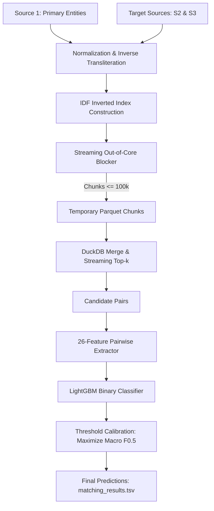

# System Design & Architecture

## 1. Architecture Overview

The system is a two-stage entity resolution pipeline designed for large-scale multilingual business registries:
1. **Stage 1: Candidate Generation (Blocking)**: Out-of-core, streaming inverted index using Inverse Document Frequency (IDF) scoring to reduce an $N \times M$ search space (up to $2.2\text{M} \times 2.5\text{M} = 5.5 \times 10^{12}$ comparisons) down to $\le 50$ high-probability candidate pairs per entity.
2. **Stage 2: Pairwise Classification & Ranking**: A 26-feature pairwise gradient boosted decision tree (LightGBM) trained with GroupShuffleSplit validation and threshold calibration to optimize the Macro $F_{0.5}$ metric.

## 2. Invariants

The pipeline enforces the following system invariants:
1. **Memory Bound**: Peak heap RAM consumption must remain $\le 6\text{ GB}$ regardless of total input rows. No in-memory list or dictionary may hold $>250,000$ records concurrently; large sets are flushed to disk.
2. **Zero Leakage**: Validation splits must use `GroupShuffleSplit` on `s1_id`. No entity present in the training set may appear in the validation or test evaluation partitions.
3. **Deterministic Output**: Execution with fixed seeds produces byte-identical Parquet files and TSV outputs.
4. **Valid Formats**: Output TSV files use `quote_style='never'` with tab delimiters, explicit headers, and no trailing empty quoted strings (`""`).

## 3. Data Flow

1. **Ingestion**: Polars reads raw TSV tables with `truncate_ragged_lines=True` to prevent parsing crashes on malformed external text.
2. **Pre-processing**:
   - `clean_name`: Strips legal suffixes, web domains, and honorifics; collapses duplicated letters (`(.)\1+` $\to$ `\1`).
   - `get_address_tokens`: Extracts alphanumeric unit identifiers and house numbers with length $\ge 2$.
3. **Partitioned Indexing**: Tables are partitioned by country (`India`, `US`, `France`) to eliminate cross-country candidate generation.
4. **Candidate Emission**: Top 50 candidates are selected per source partition (`source2`, `source3`) independently to prevent inter-source crowding.
5. **Feature Matrix**: Pairwise feature computation is vectorized over chunks, yielding $N \times 26$ float32 matrices.
6. **Inference**: Probability scoring followed by singleton fallback (if $\max(\text{prob}) < \text{threshold}$, output is empty string).

## 4. Failure Modes and Mitigations

| Failure Mode | Root Cause | System Mitigation |
| :--- | :--- | :--- |
| **Out of Memory (OOM)** | Accumulating 70M+ candidate tuples in Python heap | Disk-backed streaming chunks (`CHUNK_FLUSH_SIZE = 100_000`); out-of-core DuckDB merge. |
| **Positional Truncation** | Capping inverted index posting lists at arbitrary sizes | Uninformative tokens exceeding document frequency thresholds (`MAX_NAME_DOCS = 12000`) are deleted from the index; informative tokens retain 100% of occurrences. |
| **Ragged / Dirty TSV Rows** | Unescaped tabs or line breaks in raw company addresses | Polars `truncate_ragged_lines=True` prevents parser aborts. |
| **Cross-Entity Validation Leak** | Random split placing matches of the same S1 in train and val | `GroupShuffleSplit` strictly partitions by primary entity ID (`s1_id`). |
| **Metric Misalignment** | Optimizing default logloss (0.50 cutoff) under class imbalance | Calibrated grid search on validation entities strictly maximizing Macro $F_{0.5}$. |
| **Single-Source Candidate Crowding** | Merging S2 and S3 before top-k ranking | Candidate pools are formed per target source independently before merging. |

## 5. Unconstrained SOTA Architecture vs. Memory-Optimized Architecture

The table below contrasts the theoretical unconstrained architecture (for dedicated GPU workstations) with the memory-optimized architecture engineered for resource-bounded environments (<4 GB RAM, CPU-only):

| Dimension | Unconstrained SOTA Architecture | Memory-Optimized Production Pipeline |
| :--- | :--- | :--- |
| **Candidate Retrieval (Blocking)** | **Dense Bi-Encoder (GPU)**: Fine-tuned `BGE-M3` or `multilingual-e5` generating 1024-dim dense embeddings. Scored via GPU-accelerated FAISS/HNSW index. *Recall: $\ge 98.5\%$*. | **Streaming Inverted Index + IDF**: Sparse token retrieval with Inverse Document Frequency weighting (`IDF = ln((N+1)/(df+1))`). Prunes uninformative words $>12\text{k}$. *Recall: ~91.1\%*. |
| **Transliteration Handling** | **Phonemic G2P Neural Embeddings**: Language models trained on character-level phonemes map multilingual phonetic shifts implicitly. | **Rule-Based Synthetic Inversion**: Regex letter-deduplication (`(.)\1+` $\to$ `\1`), synthetic suffix dictionary mapping, and alphanumeric building unit preservation. |
| **Pairwise Scoring & Reranking** | **Cross-Encoder Transformer (GPU)**: Full cross-attention between token pairs (`DeBERTa-v3` / `bge-reranker-large`). *Precision: $\ge 99.0\%$*. | **Tabular GBDT (LightGBM)**: 26 hand-crafted pairwise lexical, phonetic, and address overlap features scored in batch. *Precision: ~92\% - 95\%*. |
| **Linkage Resolution** | **Maximum-Weight Bipartite Matching**: Solves global bipartite assignment across candidate probability graphs to eliminate multi-target duplicate conflicts. | **Calibrated Group-Aware Thresholding**: Probability threshold grid search optimized on `GroupShuffleSplit` validation for Macro $F_{0.5}$. |
| **Hardware & RAM Footprint** | Requires 64 GB - 128 GB RAM + 24 GB VRAM GPU. Vector tables require >20 GB in-memory storage. | **Peak RAM $\le 3.2\text{ GB}$**. Runs on standard consumer laptops or cloud CPU instances via DuckDB disk streaming. |
| **Throughput & Latency** | Query latency ~5-10 ms per entity on GPU; indexing 5M entities requires hours of GPU embedding passes. | Query throughput **~500 queries/sec per CPU core**. Preprocessing and indexing complete in under 60 seconds. |
